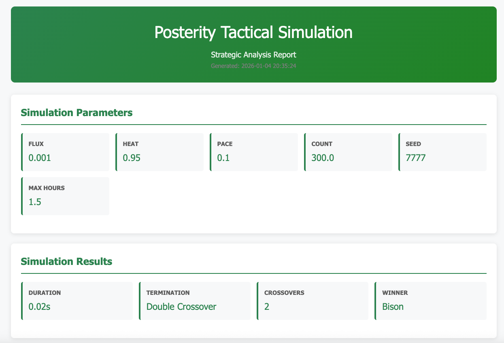
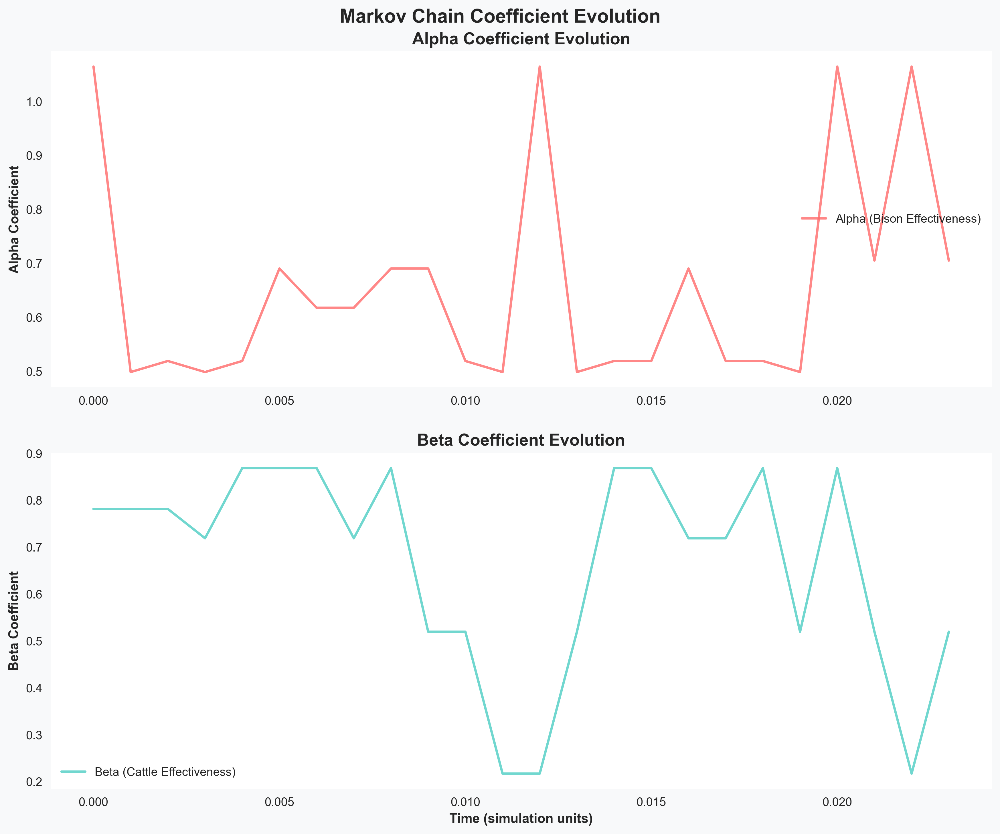
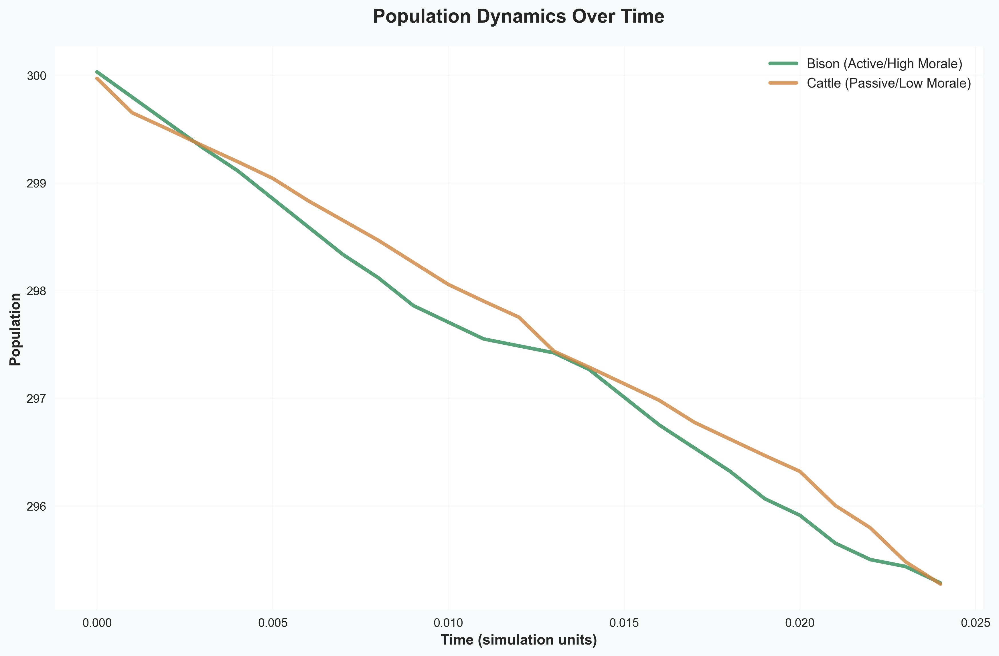
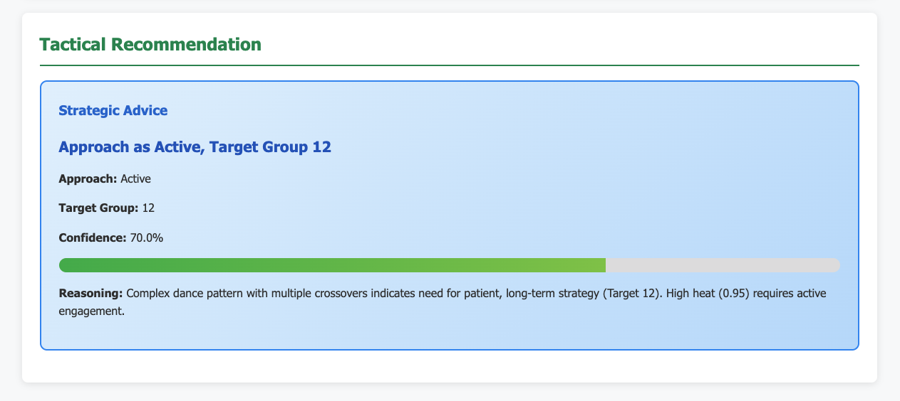

# Posterity.gurila.tools : May the Tism be With You

A tactical simulation engine that models social dynamics using the Lanchester Laws of conflict. This project is a Python 3.10+ rewrite of the legacy Java Android application "Posterity", designed to simulate the "dance" between two forces: **Bison** (Active/High Morale) and **Cattle** (Passive/Low Morale).



*Example simulation results showing parameter configuration, termination analysis, and tactical recommendations*

## License

This program is free software: you can redistribute it and/or modify it under the terms of the GNU General Public License as published by the Free Software Foundation, either version 3 of the License, or (at your option) any later version.

Copyright (C) 2026 Jefferson Richards <jefferson@richards.plus>

## Requirements

- **Python 3.10 or later** (required for modern type hinting and performance optimizations)
- NumPy >= 1.21.0
- SciPy >= 1.7.0
- pytest >= 6.0.0 (for testing)

## Project Overview

`posterity.gurila.tools` implements a sophisticated tactical simulation system that combines:

1. **Lanchester Laws**: Mathematical models for attrition over time between opposing forces
2. **Stochastic Coefficients**: Dynamic effectiveness constants derived from Markov Chain transitions
3. **Markov Chain Dynamics**: State transitions that pull values from specific probability distributions (Normal, Left-Skewed, Right-Skewed)



*Markov chain coefficient evolution showing the stochastic nature of the effectiveness constants (Alpha and Beta) that drive population dynamics. High volatility in coefficients creates the complex behavioral patterns observed in the simulation*
4. **Tactical Heuristics**: The 3-7-12 decision framework for social approach strategies

## Core Concepts

### The Dance
The simulation models a "dance" between two population types:
- **Bison**: Represents active, high-morale individuals
- **Cattle**: Represents passive, low-morale individuals



*Population dynamics over time showing the complex "dance" between Bison and Cattle populations, including crossover events that indicate shifts in social dominance*

### Input Parameters
- **Flux**: Rate of change in the system
- **Heat**: Volatility of the Markov chain (affects coefficient variation)
- **Pace**: Speed of iteration (temporal resolution)
- **Count**: Initial population sizes

## Usage Examples

### Basic Simulation
```bash
python3.10 main.py --flux 0.5 --heat 0.8 --count 50
```

### Venue-Specific Presets
```bash
# Quiet coffee shop dynamics
python3.10 main.py --venue cafe --seed 123

# High-energy nightclub scenario  
python3.10 main.py --venue nightclub --seed 42

# Large festival with complex crowd flows
python3.10 main.py --venue festival --seed 2024
```

### Dramatic Scenarios
```bash
# Generate parameters optimized for complex dynamics
python3.10 main.py --dramatic --seed 777

# Analyze complexity potential of custom parameters
python3.10 main.py --flux 0.001 --heat 0.95 --pace 0.1 --count 300 --analyze-complexity
```

### Available Venues
- **cafe**: Quiet coffee shop with steady, low-energy interactions
- **grocery_store**: Functional shopping environment with task-focused interactions  
- **nightclub**: High-energy social venue with intense, volatile dynamics
- **public_event**: Large gathering with diverse groups and complex social flows
- **office_party**: Professional social gathering with constrained but evolving dynamics
- **house_party**: Intimate social gathering with personal dynamics and group formation
- **conference**: Professional networking with structured but dynamic interactions
- **festival**: Large outdoor event with diverse activities and crowd flows
- **dramatic**: Artificially tuned for maximum complexity and double crossovers

## Visual Examples

The system generates comprehensive visual reports for every simulation, providing insights into population dynamics, coefficient evolution, and strategic recommendations:

### Population Dynamics

*Complex population trajectories showing crossover events and the "dance" between active (Bison) and passive (Cattle) populations*

### Stochastic Coefficients  

*Markov chain coefficient evolution demonstrating the volatility that drives complex social dynamics*

### Strategic Analysis

*Tactical recommendations based on the 3-7-12 framework, providing actionable social strategy advice*

### Simulation Summary

*Complete simulation overview with parameters, results, and strategic recommendations*

## Architecture

The project follows a modular Python architecture with the following key components:

### Core Engine (`core/`)
- `physics.py`: Mathematical engine implementing Lanchester equations and Markov chains
- `simulation.py`: Main simulation runner with termination conditions

### Analysis Layer (`analysis/`)
- `tactics.py`: Heuristic interpretation layer implementing 3-7-12 logic

### Interfaces (`interfaces/`)
- `vision_hooks.py`: Future AR integration hooks for computer vision input

### CLI & Main
- `main.py`: Command-line interface for running simulations

## Key Features

### Mathematical Rigor
- Vectorized operations using NumPy for efficiency
- Stable numeric solvers for differential equations
- Proper handling of stochastic processes

### Termination Conditions
The simulation runs until one of these conditions is met:
1. **Annihilation**: One population drops to ≤ 0
2. **Crossover**: Population curves cross once
3. **Double Crossover**: Curves cross twice (complex "dance")
4. **Time Limit**: Equivalent of 1.5 hours in simulation time

### Tactical Intelligence
- Interprets simulation volatility patterns
- Maps outcomes to strategic recommendations
- Provides actionable advice for social dynamics


*Strategic analysis output showing the 3-7-12 framework recommendations. The system analyzes simulation complexity to provide tactical advice: Active vs Passive approach strategies and optimal target group sizes (3 for Strike, 7 for Balance, 12 for Longevity)*

### Complexity Analysis

The system can analyze parameter combinations to predict the likelihood of different outcomes:

```bash
python3.10 main.py --flux 0.001 --heat 0.95 --pace 0.1 --count 300 --analyze-complexity
```

**Complexity Metrics:**
- **Complexity Score**: Overall potential for complex dynamics (0.0-1.0)
- **Double Crossover Probability**: Likelihood of populations crossing twice
- **Single Crossover Probability**: Likelihood of one population reversal
- **Annihilation Probability**: Likelihood of quick decisive outcome

**Factors for Complex Dynamics:**
- **Low Flux** (≈0.02): Creates balanced initial conditions
- **High Heat** (>0.8): Increases volatility and unpredictability  
- **Moderate Pace** (≈0.2): Allows complex patterns to develop
- **Large Populations** (>200): Sustain longer dynamic interactions

## Technology Stack

- **Python 3.10+**: Core language with modern type hinting and performance optimizations
- **NumPy**: Vectorized mathematical operations for efficiency
- **SciPy**: Statistical distributions and advanced mathematical functions
- **Matplotlib**: Professional chart generation for population dynamics visualization
- **Jinja2**: HTML template engine for report generation
- **WeasyPrint**: PDF generation with proper margin handling
- **Type Hints**: Full type annotation for maintainability and IDE support
- **pytest**: Comprehensive testing framework

## Reporting Features

Every simulation run automatically generates a comprehensive report in a standalone subfolder within the `simulation_reports` directory at the project root. Each report is stored in a timestamped folder: `simulation_reports/simulation_report_YYYYMMDD_HHMMSS/`

### Generated Files
- **`report.html`**: Interactive HTML report with charts and analysis
- **`report.pdf`**: Professional PDF report with proper margin formatting
- **`population_trajectory.png`**: Population dynamics chart over time (only for full simulations)
- **`coefficient_evolution.png`**: Markov chain coefficient evolution chart (only for full simulations)
- **`raw_data.json`**: Complete simulation data in JSON format

**Note**: Chart files (PNG) are only generated for full simulations with trajectory data. The grocery store scenario generates only HTML, PDF, and JSON files.

### Report Contents
- Simulation parameters and configuration
- Population dynamics visualization
- Coefficient evolution analysis
- Tactical recommendations with confidence levels
- Termination analysis and crossover detection
- Professional styling optimized for both screen and print

### Report Options
```bash
# Generate full report (default) - outputs to simulation_reports/
python3.10 main.py --flux 0.5 --heat 0.8 --count 50

# Skip report generation
python3.10 main.py --flux 0.5 --heat 0.8 --count 50 --no-report

# Custom report directory (still creates simulation_reports subfolder)
python3.10 main.py --flux 0.5 --heat 0.8 --count 50 --report-dir ./my_reports
```

## Contact & Support

- **Author**: Jefferson Richards
- **Email**: jefferson@richards.plus
- **License**: GNU General Public License v3.0 or later

For bug reports, feature requests, or contributions, please contact jefferson@richards.plus.

## Future AR Integration

The system is designed with hooks for future augmented reality integration:
- Computer vision input for real-time crowd analysis
- Automatic parameter extraction from video feeds
- Anomaly detection for identifying Bison vs Cattle behavior patterns

## Installation & Usage

### Prerequisites
Ensure you have Python 3.10 or later installed:
```bash
python3 --version  # Should show 3.10.x or higher
```

### Install Dependencies
```bash
# Install required packages
pip3 install numpy scipy pytest

# Or install from requirements file
pip3 install -r requirements.txt
```

### Run Simulation
```bash
# Basic usage
python3 main.py --flux 0.5 --heat 0.8 --count 50

# Grocery store scenario (should output passive recommendation)
python3 main.py --grocery-store

# JSON output for integration
python3 main.py --flux 0.2 --heat 0.9 --count 100 --json

# Quiet mode (just the recommendation)
python3 main.py --flux 0.5 --heat 0.8 --count 50 --quiet
# Expected output: "Approach as Active, Target Group 7"
```

### Run Tests
```bash
# Run all tests
python3 -m pytest tests/ -v

# Run specific test module
python3 -m pytest tests/test_physics.py -v
```

## Development Philosophy

This rewrite prioritizes:
- **Efficiency**: Optimized for mobile/AR hardware deployment
- **Modularity**: Clean separation of concerns
- **Extensibility**: Ready for future AR and ML integration
- **Maintainability**: Comprehensive type hints and documentation

---

*Posterity.gurila.tools - Where tactical simulation meets social dynamics*